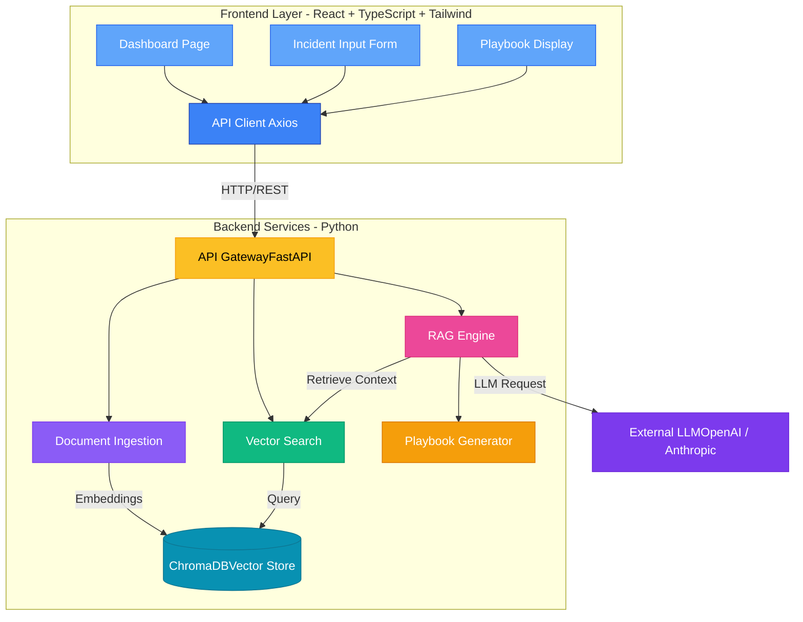

Runbook RAG System:
AI-powered incident remediation system that generates step-by-step playbooks using RAG (Retrieval-Augmented Generation).
What It Does
Upload your runbook documentation, describe an incident, and get an automated remediation playbook with relevant context from your documents.

Features:
 1.Upload runbook documents (PDF, DOCX, TXT, MD)
 2.Semantic search through documentation
 3.AI-generated incident remediation steps
 4.Clean, modern web interface.

 Backend Setup:
 cd backend
 python -m venv venv
 .\venv\Scripts\activate 
 pip install -r requirements.txt
 uvicorn src.main:app --reload --port 8000
 Backend runs at: http://localhost:8000

 Frontend Setup:
 cd frontend
 npm install
 npm run dev
 Frontend runs at: http://localhost:3000

 Tech Stack:
Backend:

FastAPI
LangChain
ChromaDB
OpenAI/Anthropic

Frontend:

React 18
TypeScript
Tailwind CSS
Vite

PROJECT STRUCTURE:

incident-remediation/
├── backend/
│   ├── src/
│   │   ├── api/             
│   │   ├── modules/          
│   │   ├── config.py
│   │   └── main.py
│   └── requirements.txt
│
├── frontend/
│   ├── src/
│   │   ├── components/       
│   │   ├── pages/            
│   │   ├── services/         
│   │   └── App.tsx
│   └── package.json
│
└── README.md

Usage:

Start both backend and frontend servers
Open http://localhost:3000
Upload runbook documents
Enter incident description
Get AI-generated remediation playbook

